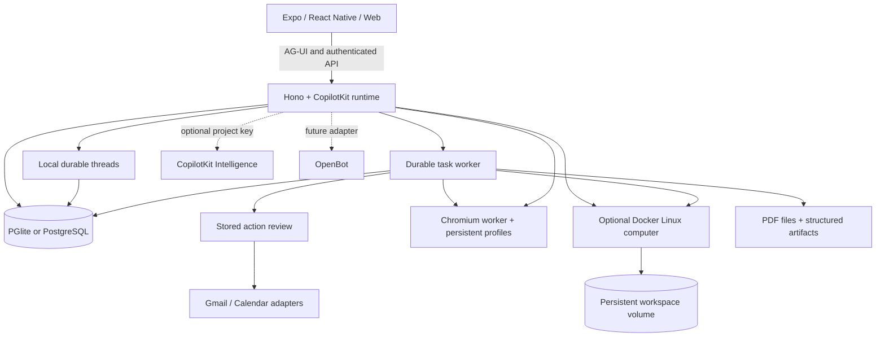

  <div align="center">

# OkamiBot

**A personal agent with a browser, terminal, files, and work that keeps going. Compatible with any agent harness.**

Ask for an outcome. Follow the plan, review actions, and come back to the result.
Built with CopilotKit React Native for iOS, Android, and web.

Model-backed chat and task workers execute the [copied OpenClaw embedded harness](third_party/openclaw/README.md#active-embedded-harness-5-october-2026).
The pinned upstream source is compiled inside this service, with the existing
authenticated providers, owned tools, durable task records and app UI.

OkamiBot is this personal-agent fork of [OpenMuse](https://github.com/CopilotKit/OpenMuse). Upstream MIT notices, technical identifiers and the historical demo recordings are preserved. [Local Android release builds](docs/ANDROID-RELEASE.md) use the existing SDK without a paid cloud build service.

[Quick start](#quick-start) · [Demo](#demo) · [Features](#features) · [Architecture](#architecture) · [Docs](docs/README.md) · [Contributing](CONTRIBUTING.md)

[Personal 2-vCPU / 8-GB VPS deployment](DEPLOY.md) runs the self-hosted API, browser and guarded open computer with persistent state and daily backups.

[Abrir a instalação atual e testar pelo navegador ou Android](docs/FIRST-ACCESS.md).

[](https://github.com/CopilotKit/OpenMuse/actions/workflows/ci.yml)
[](LICENSE)

<a href="https://trendshift.io/repositories/254992?utm_source=trendshift-badge&amp;utm_medium=badge&amp;utm_campaign=badge-trendshift-254992" target="_blank" rel="noopener noreferrer"></a>

[](https://render.com/deploy?repo=https://github.com/CopilotKit/OpenMuse)

Clone this template and customize it however you want.

**[Building on OpenMuse? Meet with the CopilotKit team →](https://www.copilotkit.ai/talk-to-an-engineer?ref=openmuse_hero)**

https://github.com/user-attachments/assets/8014d185-346c-4954-8ff0-26c582c5093a

https://github.com/user-attachments/assets/0cc87de0-c3c1-4f24-b7df-e7d04bb946fd

</div>

> **Alpha, for self-hosting and building on.** Open-ended reasoning and live Google accounts require their own configuration. Conversations persist on your server without a CopilotKit key. See [what is verified](docs/VERIFICATION.md) and the [roadmap](ROADMAP.md).

## Demo

On iPhone, ask OpenMuse to find interesting stories on Hacker News and summarize CopilotKit. On desktop, ask it to check the school-trip email, open the message, and research exhibits at Monterey Bay Aquarium. The agent shows email and browser results inline. **Take control** opens that same browser session when you need it.

The 38-second iPhone and 42-second desktop web demos show the current interface, framed in 16:9. The send arrow becomes a stop square inside the input pill while the agent replies, then switches back. Stopping keeps your draft intact. See the [recording notes](docs/DEMO.md) for the model setup and reproduction steps.

[Mobile MP4](https://github.com/user-attachments/assets/8014d185-346c-4954-8ff0-26c582c5093a) · [Web MP4](https://github.com/user-attachments/assets/0cc87de0-c3c1-4f24-b7df-e7d04bb946fd) · [Recording details and reproduction](docs/DEMO.md)

The [Jev aquarium-trip demo](docs/demos/jev-generative-ui.md) walks through a fictional school email, clarification choices, sourced exhibit cards, hands-on preference refinement, and a confirmed selection. [Watch the 83-second live Jev recording](assets/demos/2026-09-23/jev-live-web.mp4), where TypeSafe Jev makes the decisions and a scripted agent keeps the trip scenario repeatable. A [scripted-decision sample recording](assets/demos/2026-09-23/jev-web.mp4) is also available.

## What it is

OkamiBot is a personal-agent application with an agent computer, visible work, and rich results. It runs its own server, task worker, and browser worker. You can inspect and change the source under the MIT license.

The computer combines **persistent Chromium and an optional Linux workspace**. The agent can browse public pages, run commands, work with files, and move PDFs between the computer and the app. The native executor shares its own X11 desktop and headed browser with a trusted mobile viewer; **Take control** reserves GUI and DOM input together, and handback resumes the same task. See [native desktop setup and acceptance limits](docs/NATIVE-DESKTOP.md). The guarded open profile adds Office/media files and background jobs. Payment controls use native review before execution.

## Features

| Surface | What runs in this alpha |
| --- | --- |
| **Chat** | CopilotKit headless chat with streamed AG-UI events, mailbox search and reading, send/stop in one input pill, a visible follow-up queue, retained drafts, delegated tasks, and inline email, browser, PDF, plan, and finance cards. |
| **Agent computer** | Persistent browser profiles and takeover console; registered native desktop with masked observations and device-bound GUI input; optional isolated Linux terminal, saved command receipts, editable workspace files, and PDF transfer. |
| **Activity** | Durable task plans, progress, input requests, pause/resume/cancel/retry, approvals, and saved receipts. SQL leases recover interrupted work. |
| **Ideas** | Suggestions with source evidence; edit, accept, or dismiss. Sent replies and completed matching work are excluded. |
| **Goals & Tracking** | Goals and milestones; recurring public-page checks for changes, text availability, or USD price thresholds, with deduplicated alerts and failure backoff. |
| **Documents** | Email attachment → PDF → requested form values → filled copy → reviewed reply → receipt. Native/web PDF viewing, paging, zoom, supported fields, and sharing. |
| **Finance** | Import transaction CSV to create a spending summary with categories, transactions, and a savings-goal action. |
| **Gmail & Calendar** | Google OAuth adapters, complete mail threads, drafts/attachments, calendar discovery, and autonomous event creation/update/deletion under configurable policy. Live credentials required. |
| **Personal context** | Editable name, tone, avatar, and memories. Background-update preferences and durable in-app notifications. |
| **Rich Threads** | Self-hosted PGlite/Postgres persistence, stable main conversation, side chats, renaming, archiving, restoring and rich AG-UI replay. Optional legacy Intelligence storage. |

The [feature inventory](docs/FEATURES.md) describes implemented capabilities and planned extensions. Native APNs/FCM push and configurable image-generation adapters are installed and require operator credentials/device consent. Remote MCP connectors use explicit per-server tool allowlists. Health/bank/social integrations, voice and generated executable tools remain on the [roadmap](ROADMAP.md); supported financial actions require native review.

## Quick start

**Requirements:** Node 24 LTS and pnpm 11.19.0. The local sample app needs no model, vendor key, Google account or Docker.

```sh
git clone https://github.com/CopilotKit/OpenMuse.git openmuse
cd openmuse
pnpm install --frozen-lockfile
cp .env.example .env
pnpm dev
```

In another terminal:

```sh
pnpm dev:web
```

Open [localhost:8081](http://localhost:8081). The API runs at [localhost:8787/api/health](http://localhost:8787/api/health).

### Try it

1. In Chat, send **“Complete the permission slip”**. Open the task, supply fictional form values, inspect the saved PDF, and review the prepared reply. This writes only to the local mailbox.
2. In **Goals → Track**, create a built-in availability watch, then change the built-in test page to trigger an alert.
3. In **Menu → Delegate task → Finance**, use **Try example transactions** to create an interactive spending tracker.
4. Start the [browser worker](#browser-worker) and configure a model, then ask **“Check out Hacker News for cool stuff”** or **“Summarize copilotkit.ai”**. Follow the browser inline and use **Take control** to open its session. For a model-free version of this flow, follow the [AI Mock demo setup](docs/DEMO.md#run-the-agent-browser-demo).

For iOS or Android, use `pnpm --dir apps/mobile ios` or `pnpm --dir apps/mobile android`. Xcode or Android tooling is required. The PDF reader needs an Expo development build; use [native setup](apps/mobile/README.md).

## Deploy on Render

[](https://render.com/deploy?repo=https://github.com/CopilotKit/OpenMuse)

[render.yaml](render.yaml) deploys three services: the API, the web app, and a private browser. The API answers `/` with JSON, so the UI is its own static site.

### First run

1. Click **Deploy to Render**. Wait until `openmuse-api`, `openmuse-web`, and `openmuse-browser` are live.
2. On `openmuse-api`, open **Environment** and copy `OPENMUSE_ACCESS_KEY`.
3. Open the `openmuse-web` URL and sign in with that key.
4. Send a message.

The deploy form asks for the model key. Render generates the access and encryption keys.

| Variable | Set by | If it is missing |
|---|---|---|
| `OPENAI_API_KEY` | You. Used by the default `openai/gpt-5`. Change `MODEL` and supply the matching provider key for Anthropic or Google. | The model call fails. |
| `OPENMUSE_ACCESS_KEY` | Render | You cannot sign in. |
| `TOKEN_ENCRYPTION_KEY` | Render | The API refuses to start in live mode. |

Health check: `https://<openmuse-api>/api/health`.

### Services

| Service | Plan | What it runs |
|---|---|---|
| `openmuse-api` | Standard, with a 1 GB disk at `/var/data` | The Hono API and the in-process task worker. `DATA_DIR` is `/var/data/openmuse`. |
| `openmuse-web` | Static site | The Expo web export. `EXPO_PUBLIC_API_URL` is baked in at build time. |
| `openmuse-browser` | Private service, Standard, 1 GB disk at `/data` | Playwright and Chromium. The API calls it on the private network. |

**Standard** is the smallest plan that stays up. At 512 MB the process runs out of memory before it binds a port, because PGlite loads an embedded Postgres build.

**The disk** holds the database, conversations, PDFs and signing key. A redeploy without it wipes that data. Keep a persistent disk and backups; if using `DATABASE_URL`, back up that Postgres database as well.

**Live mode** is required. Render binds `0.0.0.0`, and sample mode rejects any host that is not loopback. The Blueprint sets `WORKSPACE_MODE=live`.

**Browsing is included, and you can take it out.** `openmuse-browser` is a private service, so it has no public URL. The API reaches it at `http://openmuse-browser:8790` with a token Render generates. If the private hostname is not `openmuse-browser`, set `BROWSER_WORKER_URL` to `http://<that-host>:8790`. To deploy without it, delete the `openmuse-browser` service and the `BROWSER_WORKER_URL` and `WORKER_TOKEN` entries on `openmuse-api`. Chat, drafts, and tasks still run. Page reads, screenshots, and **Take control** do not.

The Docker computer and Google mail or calendar need the setup in the sections below. This Blueprint does not start them.

## Configure the agent and Google

Copy the commented settings in [.env.example](.env.example) into your private `.env`:

1. Set `AGENT_BACKEND=model`, `MODEL=provider/model-id`, and the matching provider key. CopilotKit supports the configured OpenAI, Anthropic or Google provider. Fictional data can still be used with a real model. Provider keys stay on the server.
2. Conversations persist in `.openmuse/postgres`, or `DATABASE_URL` when configured. Keep the data volume backed up. No CopilotKit key is needed.
3. For personal mail/calendar, set `WORKSPACE_MODE=live`, a random `OPENMUSE_ACCESS_KEY` of at least 24 characters, and `TOKEN_ENCRYPTION_KEY` containing 32 random bytes encoded as base64. Restart the API.
4. Configure a Google OAuth web client with Gmail and Calendar APIs enabled. Set `GOOGLE_CLIENT_ID` and `GOOGLE_CLIENT_SECRET`; register `${PUBLIC_API_URL}/api/google/callback` as its redirect URI. Configure consent/test-user access in your Google project.
5. Open **Apps → Gmail** (or **Google Calendar**), connect read access, and grant write access when needed. Live send/reply and calendar writes run autonomously with `APPROVAL_POLICY=money`; use `all` for stored reviews. Payments/purchases/transfers always require native review. Changing/disconnecting the account invalidates pending connection-bound work.

Google credentials are encrypted at rest. File URLs and browser consoles use short-lived signatures. This deployment uses one owner protected by a shared access key; it is not a multi-tenant authentication system. Use HTTPS and restricted network access for a remote host. Keep the default local-data mode on loopback.

## Browser worker

Set `BROWSER_WORKER_URL=http://127.0.0.1:8790` and a random `WORKER_TOKEN` of at least 32 characters in `.env`.

```sh
pnpm --dir apps/worker exec playwright install chromium
pnpm dev:browser
```

Or use `docker compose --env-file .env -f infra/compose.yaml up --build -d`. The same token must reach the API and worker. Sessions have persistent Chromium profiles; the app can open a live screenshot console and import PDF downloads. Agent tools can read public pages and hand interactive work to the person. [Worker setup and boundaries](apps/worker/README.md).

## Persistence and operation

### Linux terminal and workspace

Build the computer image, enable it on the API, then open **Computer → Terminal → Start computer**:

```sh
docker build -t openmuse-computer:local apps/computer
COMPUTER_ENABLED=true pnpm dev
```

The API needs access to the Docker CLI and engine. Commands run in a nonroot container with no host-directory mounts or credentials. A named `/workspace` volume retains files when stopped. This offline profile disables terminal networking and limits commands to 30 seconds, with saved output/exit receipts. For the guarded open RPC profile with public networking, persistent home, Office/media tools and foreground commands up to 30 minutes/background jobs, use [the VPS Compose deployment](DEPLOY.md). **Files** supports folders, text editing, and PDF transfer to/from Documents. This is a Linux container, not a full operating-system VM. [Setup, Colima option, and boundaries](docs/COMPUTER.md).

### Application storage

By default, embedded PGlite, documents and the signing key live in `.openmuse/`; browser profiles live in `.openmuse/browser-profiles/`. Keep that directory private and back it up. The API hosts the task worker. The host must remain running for background work.

For a separate task worker, configure the same `DATABASE_URL`, secrets and shared `DATA_DIR` for both processes, then set `TASK_WORKER_ENABLED=false` on the API and run `pnpm dev:worker`. PGlite cannot be opened by separate processes. Production commands are `pnpm build:server`, `pnpm start` and `pnpm start:worker`. Run one API instance; task workers coordinate through SQL leases.

No hidden retry occurs after an uncertain external write. Review its provider outcome before creating a replacement. Pausing/cancelling prevents subsequent task steps; an already approved in-flight provider request may finish.

## CopilotKit Rich Threads

Conversations persist in OpenMuse's own PGlite/Postgres database by default. The native menu uses `useThreads`; rich tool results, state and replay remain on your server. No CopilotKit cloud calls are made in local mode. Set the optional server-only `CPK_INTELLIGENCE_API_KEY` to retain the legacy Intelligence behavior; switching backends does not migrate existing history.

The local adapter and existing CopilotKit client/runtime remain MIT licensed. Optional Intelligence is a separately hosted service. [Configuration and validation boundaries](docs/RICH-THREADS.md).

## Architecture



| Directory | Purpose |
| --- | --- |
| `apps/mobile` | Shared iOS, Android, and web UI with CopilotKit headless hooks. |
| `apps/server` | API, CopilotKit runtime, identity boundary, task engine, reviews, files, and persistence. |
| `apps/worker` | Token-protected Playwright browser service with persistent profiles. |
| `apps/computer` | Nonroot Linux image, bounded filesystem helper, and real container verification. |
| `packages/domain` | Shared types and request validation. |
| `packages/integrations` | Google and browser protocol adapters. |
| `packages/backends` | Optional OpenBot HTTP adapter and its identity boundary. |
| `tests` | Workflow, runtime, persistence, provider-contract, and authorization tests. |

### OpenBot compatibility

OpenMuse's native client and personal-agent workflows are independent of OpenBot. The disabled OpenBot adapter is pinned and contract-tested against upstream interfaces. Live user/session bridging, routine mapping, and computer backend wiring remain future work. OpenBot's Intelligence runtime is not a raw AG-UI endpoint. [Integration contract](docs/OPENBOT-INTEGRATION.md).

## Development

```sh
pnpm lint
pnpm typecheck
pnpm test
pnpm build:server
pnpm build:web
pnpm build:ios
pnpm build:android
pnpm --dir apps/worker typecheck
pnpm test:browser
pnpm test:computer
```

Platform build scripts export JavaScript/Hermes bundles; they do not produce signed app binaries. Browser checks require installed Chromium and public fixture access. CI also exercises the browser and Linux computer containers. See [contribution guidance](CONTRIBUTING.md) and [verification results](docs/VERIFICATION.md).

## Contributing and license

Issues and pull requests are welcome. Start with [CONTRIBUTING.md](CONTRIBUTING.md), [ROADMAP.md](ROADMAP.md), and the [security policy](SECURITY.md).

MIT licensed. Built by CopilotKit. Its original interface and fictional assets are included. Website, email, and document content supplies evidence, not permission to act.

Live actions and the append-only action log are described in [Autonomy and approvals](docs/AUTONOMY.md).


Native browser tools share the desktop's GUI/profile authority. `search_web` returns
bounded index sources; `browser_upload_from_workspace` binds a fresh numbered file
input to an owned workspace copy and SHA256 (5 MiB upload limit). Download tools
verify hashes and publish owned attachments or controlled workspace versions
(worker store 10 MiB/file, native transfer 8 MiB, 20 downloads/session). Popup tabs
are closed and script dialogs dismissed with safe interruption metadata. Full
multi-window workflows and connected Lenovo/mobile spreadsheet/login acceptance
remain operator validation; see [native desktop notes](docs/NATIVE-DESKTOP.md).
