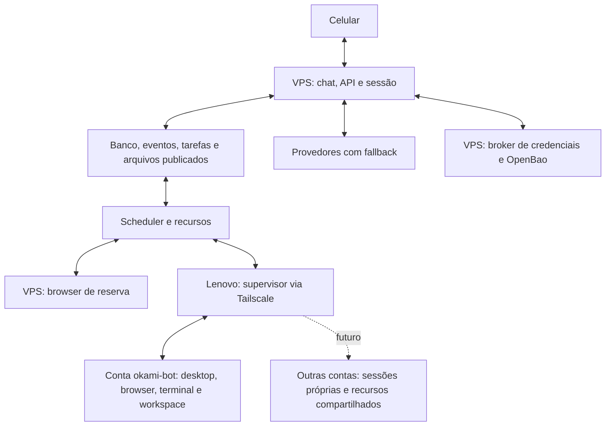

# OkamiBot: chat contínuo e computador próprio

Data: 2026-10-02. Base: `a9fe722`. Proposta solicitada pelo usuário; sem implementação ou provisionamento nesta etapa.

Revisão final do planejamento inclui a [matriz de 65 PRs upstream](2026-10-02-upstream-pr-review.md), fixada aos heads observados em 2026-10-02. Os contratos próprios abaixo prevalecem ao adaptar correções: quatro slots globais, chat independente, writer PGlite único, persistência confirmada, MONEY-only, cofre no VPS e execução nativa no Lenovo. CI de um PR mede aquela branch upstream; integração no fork exige regressão própria.

## Requisitos e alternativas

Uma usuária conversa enquanto até quatro tarefas avançam, inclusive com o aplicativo fechado. Orientações ajustam tarefas sem apagar trabalho. Pareamento não expira no uso normal. Lenovo i7-1255U / 16 GB / SSD 512 GB / Ubuntu 26.04, com Tailscale e Wi-Fi 24/7, fornece execução gráfica. VPS 2 vCPU / 8 GB mantém chat, tarefas e navegação de reserva durante quedas do notebook. Outros bots poderão usar o Lenovo futuramente. Usar somente as duas máquinas existentes. Por decisão do usuário, navegador Lenovo permanece no ambiente do bot; remover a proposta intermediária de browser protegido separado.

**Correção do usuário:** usar contas Linux diretamente no Lenovo, sem VM e sem introduzir container como substituto obrigatório. Os 16 GB ficam compartilhados; não repartir em ambientes de 8 GB. Blender, Android Studio e emulador são exemplos de uso eventual, não programas que já precisam ser instalados.

| Privilégio da conta nativa | Resultado | Limite |
| --- | --- | --- |
| Usuário comum + administração por operações fixas, recomendado | Bot opera programas/arquivos e instala dependências no próprio home; helper atende manutenção previamente definida | Exige preparar os programas e operações administrativas necessários. |
| Usuário com sudo irrestrito, cogitado pelo usuário | Pode administrar todo o Ubuntu | Pode ler outras contas, alterar firewall/cgroups/Tailscale e desativar o supervisor; separação por usuário deixa de ser garantia. |

A recomendação de sudo restrito é uma proposta de desenho, não uma remoção de acesso já aprovada ou aplicada. Não liberar shells, interpretadores, apt arbitrário, systemctl arbitrário ou socket Docker sob o rótulo de sudo restrito. Aplicações/dependências no home e um helper root-owned com catálogo de operações podem executar sem perguntas repetidas. Se for escolhido sudo amplo, marcar executor como host de confiança total e retirar as garantias de contenção contra ele; não fingir isolamento por UID.

Criar inicialmente `okami-bot`, com home privado e `/home/okami-bot/workspace`. Uma conta por bot futuro, sem criar cinco contas ou cinco desktops já no primeiro deployment. Cada conta usa Xfce + TigerVNC/Xvnc, display X11, cookies Xauthority, D-Bus, perfil Chromium e diretórios próprios. Essa tela virtual roda no mesmo kernel/Ubuntu; não reserva RAM nem inicia outro sistema operacional. O GNOME físico pode permanecer em Wayland. Não usar a sessão gráfica do administrador nem `xhost +`.

## Nome do produto e personalidade por conversa

**OkamiBot** será a marca do produto. **OpenMuse** continua identificando o upstream e a origem do código. O nome/apelido do assistente é configurável pela usuária e começa como OkamiBot para instalações novas; o nome pelo qual ele chama a usuária é um campo separado. A conta `okami-bot`, IDs de tarefas/dispositivos, perfil Chromium e diretórios não mudam quando ela pede “vou te chamar de Luna”.

O código atual tem `AgentIdentity` com nome e três tons, edição móvel e rota `/identity`. Porém, o prompt do chat principal ainda fixa “You are OpenMuse”; tarefas delegadas leem nome/tom, e as ferramentas pessoais só alteram memória/rotinas. A experiência de personalização por conversa não está completa. Corrigir cedo no marco 2, sem esperar pela memória avançada do marco 10. Evidências e comparação no [estudo do Noodle](2026-10-02-noodle-review.md).

Um serviço de perfil persistente no VPS fornece nome do assistente, nome preferido da usuária, idioma, formalidade/tom, tamanho das respostas, humor, uso de emojis e orientações de estilo limitadas. Chat e configurações chamam o mesmo serviço; prompt/contexto compartilhado aplica o perfil ao chat direto, tarefas e rotinas, inclusive após restart e troca de provedor. Preservar preferências existentes na migração. Personalidade deve orientar a experiência, sem prometer identidade absoluta entre modelos diferentes.

| Pedido | Escopo e comportamento |
| --- | --- |
| “De agora em diante me chame de Ana e responda sem emojis.” | Atualizar perfil global e confirmar os campos salvos. |
| “Seu nome agora é Luna; seja mais descontraída.” | Alterar nome do assistente e estilo, mantendo marca/conta Linux estáveis. |
| “Neste chat seja mais direta.” | Override persistente somente desta conversa. |
| “Neste e-mail use linguagem formal.” | Orientação apenas da tarefa/texto, sem alterar perfil global. |
| “O que você lembra sobre meu jeito preferido de conversar?” | Consultar configurações de estilo com escopo/origem, separadas de fatos pessoais. |
| “Volte ao jeito padrão.” | Restaurar estilo no escopo indicado; não apagar fatos, tarefas, arquivos ou conexões. |

Aplicação: padrão do produto → perfil da usuária → override da conversa → orientação pontual compatível. Pedido explícito de preferência permanente é persistido; ambiguidade material de escopo gera pergunta curta, sem interromper tarefas. O modelo propõe um patch validado, e o servidor verifica proprietário, campos permitidos, versão e idempotência. Confirmar somente depois de gravar. Fontes externas não têm autoridade para alterar o perfil: instrução numa página, e-mail ou retorno MCP não vira preferência pessoal. O histórico conserva origem do pedido e revisão aplicada.

Atualização de estilo não reinicia runtime nem cancela tarefa. Próxima resposta/ponto seguro carrega nova versão; instrução específica já aceita de uma tarefa continua prevalecendo naquele trabalho. Tarefas guardam a conversa de origem para aplicar seu override; rotinas usam perfil global salvo, salvo instrução específica da própria rotina. Perfil não altera sudo, política de dinheiro, autenticação, cofre, ferramentas disponíveis ou limites de recursos. Histórico/desfazer de perfil entra no marco 10; campos básicos e restauração simples entram no marco 2.

Preparar branding centralizado para textos e defaults novos. A futura publicação do nome exige revisar título/ícone, telas, notificações e documentação. Preservar inicialmente nomes técnicos `@openmuse/*`, diretório `.openmuse`, imagens/volumes e IDs/scheme mobile existentes para facilitar merges e continuidade. Mudar bundle/package ID pode criar outro app e perder acesso ao armazenamento de pareamento; mudar volumes pode aparentar perda de banco/logins. Qualquer migração posterior desses identificadores precisa de backup, compatibilidade de deep links/OAuth e teste de continuidade. Esta revisão não renomeia código ou dados nem altera avisos MIT.

## Recursos nativos e programas pesados

Cinco contas com processos/sessões simultâneos são suportáveis como arquitetura Linux; não garantem cinco cargas pesadas nos 16 GB. Desktops/browser são iniciados quando necessários. Uma aplicação pode usar mais de 8 GB sem mudar uma VM; a soma ainda inclui Ubuntu, todos os desktops, navegador, emulador, cache e eventual memória gráfica compartilhada.

Criar um grupo agregado de serviços dos bots sob systemd/cgroups v2, controlado pelo administrador, com subgrupos por conta/job. Sem reserva fixa por bot: `CPUWeight`/`IOWeight` distribuem disputa; `MemoryHigh` sinaliza pressão/reclaim e `MemoryMax` é limite de último recurso, não memória pré-alocada. Orçamento agregado inicial = RAM utilizável medida menos margem de 3–4 GiB para sistema/serviços; calibrar no Lenovo. Um bot sozinho pode consumir a maior parte desse orçamento. Não anunciar 16 GiB disponíveis para uma aplicação nem somar limites por usuário como se fossem RAM física adicional.

Admissão consulta orçamento, `MemAvailable` e pressão PSI; uma carga pesada por **host físico** inicialmente, não por usuário/executor. Rejeitar/deferir novo trabalho com motivo de recurso e manter chat no VPS. Não congelar processo supondo que isso libera RAM. Checkpoint e encerramento cooperativo podem liberar recursos; OOM/crash exige recibo/recuperação explícitos. Swap/zram são amortecedores de picos, não capacidade equivalente para cinco renders/emuladores.

Todos os processos do bot, incluindo desktop, D-Bus, navegador, builds e jobs descendentes, devem ficar nos grupos controlados. Não permitir que SSH/login/cron/user-manager criem rotas fora do orçamento/controle de rede; a conta é nativa, mas seus pontos de entrada são os serviços gerenciados. Outros bots só compartilham os limites globais se usarem esse supervisor; processos externos entram na medição de memória do host, sem promessa de governança pelo OpenMuse.

Blender depende da cena e de GPU/driver, além de RAM. Android Studio com um emulador é tratado como carga pesada conjunta, com limites de Gradle/AVD medidos. A documentação atual indica 16 GB mínimos para Studio + Emulator e recomenda 32 GB ou mais; o Blender recomenda 32 GB. Esses valores de máquina não são tetos por processo. A recomendação atual do Android também desaconselha CPUs Intel U-series; o i7-1255U não equivale a uma estação de desenvolvimento pesada só por ser i7. Validar GPU real, renderização dentro de Xvnc e `/dev/kvm` quando houver emulador; KVM nesse caso acelera o Android, não hospeda o bot. Acesso a render node/KVM é específico e testado, sem conceder input global ou privilégios administrativos gerais. Não instalar esses programas nem prometer desempenho sem um caso real.

## Distribuição

VPS é autoritativo para tarefas, orientações, autorizações e recibos. PGlite mantém um escritor; Lenovo não monta seu diretório nem executa `worker-entry.ts` sobre ele. Supervisor inicia conexão autenticada de saída ao VPS por Tailscale. Sua credencial só registra executores cadastrados e troca operações/recibos; não é chave administrativa ou da usuária. O agente executa shell nativo sob seu UID. Administração do supervisor aceita operações fixas sobre contas/unidades cadastradas, sem comandos root, unidades systemd ou caminhos arbitrários vindos do agente. RFB usa socket Unix privado e CDP usa pipe/IPC autorizado; loopback TCP sozinho não isola usuários. Não expor VNC, CDP ou sockets administrativos.

## Chat, tarefas e concorrência

Agente conversacional responde, consulta estado, delega e orienta. Trabalho externo/demorado vai para atores duráveis com contexto, mailbox, journal, checkpoint e cancelamento próprios. Fechar/parar uma resposta não cancela atores; cancelamento de tarefa é explícito.

Até **quatro unidades de trabalho background admitidas no total entre hosts**. Inferência ou job físico em andamento ocupa um slot. `waiting_job` libera somente vaga de inferência, conservando slot e recursos físicos. Espera por recurso/usuário/provedor/executor libera slot somente sem operação própria em curso. Resultado desconhecido conserva reservas necessárias até reconciliação. Pai em `waiting_children` libera vaga se não mantém job; filhos usam o mesmo teto e orçamento da árvore. Subagentes são contextos separados sobre esse scheduler, sem multiplicar quatro por quatro.

Proposta inicial por provedor: até três inferências background e uma admissão interativa prioritária/reservada, reduzidas pela quota real. Quatro tarefas podem avançar com ferramentas/I/O sem quatro inferências simultâneas. Uma assinatura pode impor limites menores. Quem aguarda quota não toma posse do desktop.

Recursos: `desktop:{executor}:{session}=1`, `browser-profile:{executor}:{profile}=1`, `cpu-heavy:{hostId}=1` inicialmente, `system-admin:{hostId}=1`, orçamento de memória agregado e locks de escrita. Executor aponta a uma conta nativa; vários executores podem compartilhar hostId. Diretório por tarefa dentro do workspace privado da conta: `tasks/{taskId}`; `/workspace` permanece nome lógico na API quando necessário, resolvido pelo adapter para o caminho cadastrado. Lease da sessão cobre observar→agir; fila por chamada não impede corrida entre tarefas. Operação administrativa global drena trabalho incompatível. Quatro slots OpenMuse não equivalem ao número de contas Linux, desktops ou cargas pesadas.

Reservar desktop/perfil somente antes da primeira observação/ação que realmente os exige. Chat, consulta de API e trabalho em arquivos não seguram a tela preventivamente. Distinguir ocupado de executor indisponível; nenhuma espera pode ficar infinita porque o notebook caiu entre a seleção e o primeiro clique. Essa decisão é reforçada pela implementação de lazy claim do OpenMausBot, analisada no [adendo comparativo](2026-10-02-openmausbot-review.md).

“Priorize esta tarefa” altera prioridade persistente de admissão/próximos passos, mantendo os quatro slots e os checkpoints das demais. Trabalho já despachado não é cancelado para abrir vaga. Revisões proativas usam a mesma fila, cedem prioridade ao chat/trabalho solicitado e informam atraso de revisão quando houver saturação; nunca lançar um quinto agente por fora do scheduler.

## Pausa global solicitada pela usuária

Um controle explícito “Pausar automações” grava estado/revisão no VPS sem depender de uma chamada ao modelo. Bloqueia novas admissões e despachos de tarefas, rotinas, monitores, heartbeat proativo, retries e fallbacks mutáveis; leitura de status, chat, retomada explícita e reconciliação continuam disponíveis. Mensagens comuns e encerramento de resposta nunca acionam esse controle.

Propagar revisão da pausa aos supervisores e aplicar antes de novo efeito. Jobs em andamento recebem parada cooperativa e checkpoint onde suportado; ações de browser/input são contidas. A UI distingue solicitação registrada, executores confirmados e executor sem confirmação; não mostrar “tudo parado” com Lenovo inacessível ou root sem contenção confiável. Operação externa já despachada pode concluir e continua em reconciliação, sem repetição automática. Pausa permanece após restart, inclusive no VPS; a retomada explícita revalida épocas, prazos e operações incertas e não reativa tarefas que estavam pausadas individualmente. Preservar recibos/arquivos em vez de matar indiscriminadamente todos os processos do UID.

## Orientações e continuidade

Orientação recebe `directiveId`, `clientMessageId`, `taskId`, sequência, revisão e estado recebido/aplicado. Aceitação incrementa `desiredRevision` atomicamente. O ator consome mailbox, ajusta plano e grava `appliedRevision` antes do próximo passo.

Antes de efeito externo, transação valida lease, fence e `operation.revision === appliedRevision === desiredRevision`. Orientação aceita antes desse commit torna intenção antiga `superseded`, sem despacho. Depois de `dispatching`, preservar/reconciliar resultado; orientação vale para próximos passos. Não prometer desfazer efeito já recebido pelo serviço externo. Mudança de argumentos invalida somente autorização pendente correspondente.

Alvo por cartão/chip ou referência inequívoca. Se duas tarefas forem plausíveis, pedir qual delas mantendo ambas trabalhando. Orientação após conclusão fica registrada e informa a corrida; continuação vinculada pode ser solicitada sem repetir o resultado anterior. Pausar/cancelar são comandos distintos.

Mostrar orientação recebida, aguardando aplicação e aplicada como estados diferentes. Se o transporte perder resposta após possível entrega ao executor, registrar estado incerto e reconciliar; não reenviar como nova mensagem. Uma recusa comprovada antes da entrega pode voltar à fila. Adaptar a distinção de entrega do OpenMausBot à mailbox durável, preservando revisão e barreira de efeito do OpenMuse. No celular, usar controles explícitos, sem depender de duplo Enter.

Generalizar journal: intenção → despacho → recibo → checkpoint. Estados distinguem `queued`, `dispatching`, `running`, `succeeded`, `failed`, `rejected_not_dispatched`, `superseded`, `outcome_unknown`. Recusa explícita por ocupado não é resultado desconhecido. Servidor atribui IDs vinculados a argumentos imutáveis, recuperáveis após reinício.

Limite de passos gera checkpoint/continuação quando não falta informação humana. Wake-up por término de job, recurso liberado, orientação, provedor disponível e rotina. Orçamento finito de passos/tempo/custo compartilhado pela árvore impede loops. `waiting_input` exige informação real. Rotinas exibem bloqueio e ocorrências perdidas, sem duplicar trabalho.

## Critérios de entrega e validade do pedido

Registrar resultado esperado e verificações proporcionais a cada tarefa. `finish_task` propõe conclusão; serviço valida evidência/artefatos/recibos aplicáveis antes de marcar sucesso. Arquivo precisa existir, abrir no formato esperado e atender critérios observáveis do pedido; envio/evento precisa de recibo ou estado externo confirmado; resultado incerto não vira sucesso. Comandos executados e cliques sem erro não comprovam sozinhos o objetivo. Pendência aparece como entrega parcial, distinguindo tarefa encerrada incompleta de tarefa ainda trabalhando, sem marcar todos os passos como concluídos. Verificação estrutural usa código quando possível; qualidade de conteúdo exige evidência e revisão proporcional, sem depender de um segundo modelo para tudo ou alegar validação perfeita.

O aceite inclui três tarefas reais escolhidas para a usuária: pedido, eventual orientação e resultado utilizável no celular sem assistência do desenvolvedor. Medir conteúdo correto, formato, abertura do arquivo, passos pendentes e intervenções necessárias. Fixtures e `pnpm test` não demonstram sozinhos utilidade ou capacidade do modelo real.

Separar prazo desejado de validade obrigatória da ação. “Envie antes das 16h” limita despacho; “gostaria de ter pronto às 16h” pode ser meta, com aviso se atrasar. Interpretar data/fuso no contexto da usuária e pedir detalhe somente quando a ambiguidade for relevante. Persistir validade e revalidar antes de efeito externo, após espera, retomada, retry ou fallback. Se a conexão volta às 18h para um envio válido só até 16h, preservar rascunho/trabalho e verificar se ainda deve enviar. Ação já despachada antes do limite segue reconciliação. Não inventar prazo para todo pedido nem converter vencimento em cancelamento das outras tarefas.

## Executor e partições de rede

Registro: `hostId`, `executorId`, conta/UID cadastrados, `bootId`, versão, capacidades e época. Sessão tem `desktopSessionId/sessionGeneration`; conta de site continua separada da identidade Unix. Operação carrega epoch, fence do recurso, revisão e hash dos argumentos. Defaults iniciais: heartbeat 15 s, offline 45 s, autorização de execução com TTL 30 s renovada pelo supervisor. Relógio deve incluir suspensão; revalidar antes de cada despacho e ao acordar.

Prontidão é independente de conectividade: reportar conta/runtime, display, captura, input, browser e pressão de recursos com estado e motivo. “Executor online” não confirma teclado ou desktop funcionando. Preflight deve testar as capacidades anunciadas; uma captura válida sozinha não comprova clique/drag. Falha do browser não faz o app esquecer o pareamento nem marca todo o notebook como offline.

Negociar intervalo de protocolo e versões das funcionalidades independentemente da versão do app, permitindo atualizar VPS e Lenovo em momentos distintos. Distinguir `supports` (implementado) de `ready` (sonda atual passou); registro/heartbeat não tornam capacidade pronta automaticamente. Falta de recurso gera erro específico, sem fallback silencioso para semântica incompatível. Catálogo de conectores também tem geração: resposta atrasada não restaura ferramenta revogada; indisponibilidade transitória pode manter descrição em cache, mas execução revalida autorização e disponibilidade.

No modo recomendado sem sudo amplo, watchdog administrativo revoga entrada gráfica e egress por UID dos serviços da conta após vencimento. Cálculo local já iniciado pode terminar e salvar recibo quando não requer acesso externo. Se não confirmar contenção, congelar/encerrar apenas grupos afetados e colocar executor em quarentena; não matar todo o notebook ou o usuário administrador. Sudo irrestrito pode desativar esse mecanismo: nesse modo não presumir contenção, e não migrar escrita incerta automaticamente. Na volta, reconciliar operações/recibos/arquivos. Epoch no banco sozinho não impede execução antiga offline; requisição já enviada pode concluir. Não existe exactly-once geral para serviços externos.

## Fallback de modelo

Preservar adapters e contratos atuais. Cadeia configurável, por exemplo ChatGPT → Grok/xAI → MiMo; OpenAI com API pode ocupar o primário quando explicitamente configurado. Nunca trocar assinatura por API cobrada silenciosamente. Local é opcional após teste de um modelo específico e capacidade disponível; não instalar modelo grande como dependência inicial.

Filtrar candidatos por ferramentas, visão, formato e contexto. Circuit breaker/cooldown por conta/modelo, `Retry-After`, deadlines e prioridade interativa. Falha de provedor não desloga OpenMuse. Antes de aceitação/saída visível, preservar fallback conservador atual. Após stream parcial, salvar trecho/journal e continuar de checkpoint no próximo ponto seguro; nunca repetir turno inteiro ou executar fragmento de tool call. Todos indisponíveis: `waiting_provider`, aviso e backoff limitado, conservando progresso.

## Fallback de execução Lenovo → VPS

Manter browser Playwright VPS de reserva com limite inicial 2 GiB; API/banco/modelos permanecem lá. Adapter Docker atual continua disponível para deployment legado, mas computador pesado/desktop não sobe no VPS por padrão. Seleção por capacidade, saúde, conta autenticada e versão de arquivo necessária.

| Situação | Comportamento |
| --- | --- |
| Pesquisa pública no Lenovo cai | Reabrir leitura elegível no VPS, mantendo taskId/histórico. |
| Nova tarefa de browser, Lenovo offline | VPS quando capacidades e sessão forem suficientes. |
| Site autenticado | Perfil VPS válido na conta necessária; caso contrário tentar login autorizado via cofre. Se faltar credencial/desafio, cartão inline ou Take control quando necessário. |
| Envio/checkout possivelmente despachado | Conservar intenção/lock; reconciliar recibo/estado externo antes de repetir ou migrar escrita. |
| Arquivo só no Lenovo | Aguardar publicação/reconexão; usar versão publicada somente se ela satisfizer a tarefa. |
| Desktop ou comando longo | Aguardar Lenovo; não reiniciar automaticamente em outro host. |

Sessões guardam `hostId/executorId/profileId/accountId`, geração da sessão e estado de autenticação. Há dois destinos: navegador da conta Lenovo e navegador headless VPS. Migração cria sessão, snapshot e referências novos, revalidando conta e autorizações. Perfis são independentes/persistentes. Não copiar diretório Chromium aberto, reutilizar referências DOM entre máquinas ou prometer portabilidade de cookies/MFA/IP. Reserva autenticada pode exigir login nos dois browsers, automatizado pelo broker quando o site permitir. Heartbeat perdido não autoriza duas escritas: contenção do executor anterior e reconciliação são obrigatórias.

## Desktop, controle humano e arquivos

No Lenovo, Chromium com interface roda no DISPLAY da conta do bot. Playwright, ferramentas visuais e Take control compartilham esse perfil/sessão. O VPS mantém seu browser headless próprio. Não criar browser externo adicional nem exigir terceira máquina. Ferramentas: screenshot, click/double-click, drag, type, press, scroll, windows/focus conforme a superfície. Ações recebem frame, geração de sessão e fence; reobservar depois de navegação, troca de janela, takeover ou migração. Modelo deve demonstrar visão e verificar resultado. O cofre pode autenticar ambos os destinos; os limites de confidencialidade são explícitos abaixo.

Anunciar separadamente browser DOM, screenshot, pointer e drag. Controle visual por Playwright no headless VPS entra no marco 8, além dos controles Lenovo do marco 7. Screenshot sozinho não permite agir em canvas; sem capacidade compatível, preservar o desafio e pedir ajuda. Não transferir uma ação visual para executor que só anuncia DOM.

Preferir snapshot estruturado quando suficiente; usar visão/recorte quando a tela exigir. Cada observação visual captura o estado atual, mas imagem idêntica pode ser omitida do próximo payload do modelo, com indicação explícita de ausência de mudança e frameId atual. Não reutilizar coordenadas depois de takeover/navegação e não transformar deduplicação de imagem em autorização de clique antigo. Aplicar máscaras antes de qualquer envio; medir imagens enviadas, tamanho e sucesso de verificação. Não há promessa de economia percentual sem benchmark.

Serviços gráficos e jobs têm ciclos separados. `runtime.py` atual pode varrer processos do mesmo UID; mantê-lo no adapter legado. Runtime nativo supervisiona cada job/cgroup, sem matar desktop ao cancelar um comando. Processos sob o mesmo UID podem interferir entre si; a conta separa bots, não tarefas adversariais do mesmo bot. Sudo amplo no host elimina também essa separação entre contas.

Takeover reserva desktop e perfil, suspende ações conflitantes, oferece teclado/arrasto/zoom. Handback invalida frames, libera reserva e acorda tarefa vinculada; trabalhos independentes continuam. noVNC local é opção inicial; preservar MPL-2.0 e avisos, além do MIT do OpenMuse.

O viewer é servido pela aplicação confiável; da sessão nativa atravessam somente protocolo de tela/entrada e artefatos validados, nunca HTML/JavaScript fornecido pelo bot executado com a sessão do app. Proxy não encaminha cookies/tokens administrativos, escolhe socket cadastrado e encerra sessão revogada. Preview pausa quando oculto ou com viewer aberto, reduz frequência ociosa e usa evidência visual de resultado quando útil. Pausas de login e máscaras continuam valendo; não registrar tela de credenciais no transcript.

Com rede lenta, viewer prioriza imagem recente em vez de acumular frames; reconexão exige estado visual novo. Entrada coalesce movimentos, preserva press/release e libera teclas/botões ao perder conexão, lease ou foco. Observar a tela não toma controle automaticamente. Testar arrasto interrompido e modificador preso, sem prometer FPS antes de medir no Lenovo/celular.

Workspace ativo fica no home privado da conta Lenovo. Downloads/uploads/arquivos usam paths validados, hash, versão e tamanho. Publicar entregas no VPS para acesso com notebook offline; transferências retomáveis/idempotentes. Sem NFS ou sincronização cega do perfil. Ampliar tipos de download, upload web, abas/popups e diálogos mantendo SSRF/egress.

Pesquisa sem URL inicial usa um contrato pequeno `search_web` independente do provedor: consultas, URLs/títulos/trechos, origem/data de observação, avisos e truncamento. Aproveitar contrato/cartão do PR #84 e discussão #28, mas não ativar endpoint Parallel como nova dependência padrão. Adapter inicial pode usar o navegador existente para pesquisar num mecanismo configurado ou um MCP de busca já autorizado; ambos têm limites, capacidades e erros explícitos. Busca no browser usa seus leases e orçamento, não cria outro Chromium para escapar da concorrência. Falta de adapter pronto não inventa fontes; trechos de resultados não são leitura integral da página. Revalidar guards antes de abrir links. Ferramentas indisponíveis não são anunciadas ao modelo.

Transferência usa área temporária, progresso e cancelamento próprios; publicar por ID após validação/hash, com criação exclusiva ou nova versão explícita. Revalidar origem/destino contra symlink/troca de path durante a cópia, sem sobrescrever arquivo existente por acidente. Upload do browser recebe `artifactId` autorizado, não caminho arbitrário do host. Terminal interativo no celular fica como extensão posterior; jobs estruturados com recibos são a entrega obrigatória.

Para editar arquivos existentes, preferir cópia de trabalho e publicação de nova versão. Ferramentas gerenciadas preservam versão anterior antes de substituir e usam lixeira para exclusão recuperável, com registro no journal, origem/hash e retenção por tempo/espaço. “Volte à versão anterior” restaura como nova versão após comparar estado atual; alteração humana posterior é preservada e gera conflito explícito. Falha de espaço ao preservar versão impede anunciar proteção inexistente. Backup diário é complementar. A garantia cobre operações gerenciadas e cópias de trabalho; shell/GUI arbitrários podem alterar dados fora desse caminho, sem promessa de desfazer universal. Não acrescentar aprovação genérica a essas operações.

## Pareamento e mensagens do celular

Chave forte existente pareia uma vez uma identidade revogável por aparelho. Access token 15 minutos e refresh rotativo protegido. Default proposto: sem expiração absoluta/inatividade do pareamento (`SESSION_DEVICE_IDLE_DAYS=0`); revogação explícita, remoção dos dados ou perda da credencial requer novo pareamento. Falha de rede não desloga.

No nativo, persistir sucessor/ID de rotação antes do refresh e recuperar idempotentemente estado pendente, inclusive crash após giro no servidor. Guardar hashes/versões; nunca refresh em logs. Singleflight compartilhado REST/upload/CopilotKit; renovar somente em erro próprio `SESSION_EXPIRED`. Erro OAuth Google/modelo pertence ao conector. Web: cookie HttpOnly/Secure com proteção origem/CSRF e rotação gerida pelo servidor; recuperação por recibo de rotação com sucessor cifrado, sem expor refresh ao JavaScript. Identidade da UI não muda a cada token.

Outbox local com `clientMessageId` e hash; unicidade no servidor impede repetir aceitação/criação de tarefa após perda de ACK. Eventos numerados e cursor persistido permitem replay sem cartões duplicados. Rascunhos/anexos sobrevivem a encerramento. App abre cache/estado essencial antes de dados externos; Google quebrado não bloqueia chat/arquivos/reparo.

Reabertura sincroniza snapshot e stream com cursor/replay que cubra eventos concorrentes, sem janela entre carregar histórico e assinar atualizações. Lista “Arquivos e sessões” da conversa reúne entregas, versões, previews e acesso ao desktop/browser com estado real. A usuária pode comentar uma citação ou região de captura antes de enviar; guardar origem, versão/frame, coordenadas normalizadas e comentário separado do conteúdo citado. A anotação é orientação pela mailbox, nunca clique automático na tela atual. Capturas passam pelas máscaras de credenciais e rascunhos comuns permanecem locais até Enviar.

Voz: gravação no app → transcrição → texto para modelo, respeitando a ausência de áudio na rota ChatGPT. Lenovo offline pode adiar transcrição; browser fallback não implica fallback de áudio. Texto continua disponível.

## Memória e procedimentos pessoais

Expandir a memória já existente com revisões, origem, validade opcional, histórico de alterações e desfazer pelo celular. Edição concorrente usa versão esperada; a pessoa não sobrescreve silenciosamente uma atualização do agente. Esquecimento impede reintrodução automática pela recuperação; expiração retira um fato do contexto sem apagar a evidência da alteração. Histórico e fatos continuam no banco VPS, com orçamento por modelo e recuperação por relevância, sem adotar arquivos Markdown como segundo banco autoritativo.

Perfil de personalidade, fatos pessoais e procedimentos têm contratos distintos. Perfil usa campos e escopos da seção acima; memória guarda evidência/origem; procedimento guarda passos e versão. Não converter todo fato recuperado em instrução de personalidade nem deixar uma preferência antiga sobrepor uma correção explícita recente.

A usuária pode pedir “guarde esse jeito de fazer” depois de uma tarefa concluída. Salvar procedimento versionado com entradas, passos verificados, ferramentas necessárias e critério de resultado; executá-lo cria nova tarefa no scheduler existente. Não guardar senha/cookie nem registrar uma sequência cega de coordenadas. Atualizar um procedimento não muda uma execução já iniciada, e um procedimento não amplia permissões. Marketplace/importação de equipes e execução automática de scripts recebidos não fazem parte da entrega inicial.

Gatilhos por webhook e API/MCP de controle para outros bots ficam no backlog depois da estabilização. Um futuro gatilho deve persistir evento + tarefa atomicamente, autenticar origem e aplicar os mesmos quatro slots. Não abrir porta pública nem contratar relay como efeito desta revisão.

## Heartbeat proativo: iniciativa sobre pendências reais

O usuário pediu substituir a proposta de horário de silêncio por um assistente que toma iniciativa periodicamente. Esta função passa a fazer parte do marco 11, não fica só no backlog. O ciclo procura e-mails que merecem resposta, trabalho humano iniciado e incompleto e planos que a usuária mencionou mas ainda não começou. Sugere ações úteis no próprio chat e pode notificar o celular, mesmo que ninguém abra o aplicativo. Não impor horário de silêncio como comportamento padrão.

**Intervalo inicial proposto: quatro horas**, ajustável pelo chat (“revise minhas pendências a cada duas horas”) e pelas configurações. Configuração tem versão, habilitação, intervalo e próxima revisão; o valor inicial é proposta, não medição nem exigência do usuário. `PROACTIVITY_*` distingue configuração de produto da sonda de saúde do executor (15 segundos). O scheduler no VPS persiste próxima ocorrência e chave idempotente do ciclo; uma revisão em voo por usuária. Restart/indisponibilidade coalesce intervalos perdidos em uma revisão atual, sem rajada de ciclos atrasados. Pausa global suspende novos ciclos; “pare de acompanhar esse assunto” remove somente aquele acompanhamento.

| Fonte autorizada | Evidência a procurar | Exemplo de iniciativa |
| --- | --- | --- |
| E-mails e conversas do Gmail | Pedido relevante recebido, respostas posteriores, identidade remetente/destinatária, rascunhos e resoluções conhecidas | “A escola pediu o documento e não encontrei resposta nesta conversa. Posso preparar o envio?” |
| Tarefas e arquivos compartilhados com o bot | Rascunho/cópia de trabalho, último progresso conhecido, pendência concreta e prazo | “A apresentação está com o conteúdo pronto, mas falta revisar os slides. Quer que eu continue?” |
| Planos/metas discutidos no chat | Intenção registrada, próximo passo ausente ou ainda não iniciado, adiamentos/desistência | “Você comentou sobre organizar a viagem. Posso começar pelas opções para aquelas datas?” |
| Trabalho já delegado ao OkamiBot | Bloqueio técnico resolvido e autorização/prazo ainda válidos | Retomar a mesma tarefa com seus recibos, sem pedir autorização novamente. |

A observação cobre o que a usuária contou, compartilhou ou conectou. Não inferir que um trabalho humano foi abandonado só porque um arquivo não mudou, nem supor acesso a atividades fora desses canais. Guardar fonte, instante da última observação, fato observado e inferência separados; incerteza usa linguagem como “não encontrei resposta aqui”. A API Gmail permite consultar a sequência de mensagens de um thread; a classificação proposta examina esse contexto, não usa o marcador de não lido como sinônimo de não respondido. [Threads do Gmail](https://developers.google.com/workspace/gmail/api/guides/threads).

Estender metas/tarefas e eventos existentes com responsável (usuária/bot/compartilhado), estado de intenção/início/progresso/resolução, último progresso conhecido e referência da conversa/arquivo/conector de origem. “Comecei minha inscrição” e “já terminei pelo site” atualizam o mesmo compromisso com evidência informada pela pessoa. Continuar um plano mantém goalId/taskId quando aplicável; não criar uma nova meta a cada sugestão aceita. O heartbeat não possui um segundo banco de compromissos concorrente com metas/tarefas.

Implementar coleta incremental/bounded e revalidação dos candidatos: considerar mensagens enviadas pela conta/aliases e novas respostas, não sugerir responder newsletter/recibo sem contexto útil, nem lembrar algo concluído, recusado ou adiado. Rascunho ou tarefa de preparação concluída não equivalem a mensagem enviada; resposta feita diretamente no Gmail também deve ser reconhecida. Fonte indisponível fica com freshness/erro explícitos, não prova ausência de resposta. Uma integração fora do ar não bloqueia revisão de metas/tarefas locais. Reconsultar estado antes de publicar quando necessário e sempre antes de iniciar/despachar ação a partir do cartão; resposta humana entre scan e clique invalida a sugestão antiga.

Cada oportunidade tem identidade estável por assunto/próximo passo, evidência, motivo, revisão e vínculo opcional à tarefa/meta. O heartbeat atualiza esse registro e publica por outbox com IDs duráveis; mudar a redação/modelo não cria outra pendência. Enquanto já estiver apresentada, em execução, adiada ou resolvida, evitar sugestões repetidas para o mesmo estado. Mudança material ou vencimento de adiamento pode justificar reapresentação, com motivo claro. Relevância e prazo ordenam candidatos; limites por ciclo protegem recursos sem transformar intervalo em promessa de execução imediata.

Cartões oferecem ações contextuais como **Preparar resposta**, **Iniciar**, **Continuar**, **Adiar**, **Já resolvi** e **Não lembrar deste assunto**. Respostas em texto têm o mesmo efeito. “Já resolvi” registra resolução informada pela usuária; “Adiar” preserva até data/fuso; “Não lembrar” suprime este assunto até mudança explícita de preferência. Aceitação revalida fonte/revisão e cria ou retoma uma única tarefa, com deduplicação após duplo toque/restart. Cartão não implica que trabalho começou antes de haver admissão.

Vincular também `milestoneId` quando a ajuda corresponde a uma etapa existente da meta, conforme PRs #70/#123/#91. Estado da tarefa e progresso da pessoa são conceitos separados: conclusão verificada do bot pode anexar resultado e propor marcar a etapa, mas não afirmar que toda a meta humana terminou. Edição de uma etapa usa revisão/CAS sem sobrescrever outra alteração simultânea. Consulta de calendário diretamente pelo chat, proposta no #134, recebe intervalo/fuso explícitos e resultado limitado; dados de múltiplos calendários, eventos de dia inteiro e horário de verão precisam de aceites próprios antes de alimentar agenda/heartbeat.

Trabalho já delegado continua conforme seu escopo, sem uma nova aprovação só por ser proativo. Metas novas ou passos cuja intenção não foi estabelecida são propostas de ajuda; o ciclo não transforma texto de e-mail/site em mandato da usuária. Instrução permanente, como “acompanhe esses e-mails e prepare respostas”, pode orientar as próximas revisões pelo mesmo mecanismo de perfil/rotinas. A política live continua exigindo aprovação apenas para dinheiro; uma pergunta sobre iniciar um objetivo novo não vira aprovação obrigatória para toda ação Gmail/Calendar.

Reaproveitar `RoutinesService`, `ideas`, metas/tarefas, publicações e push existentes por adapter/serviço `ProactivityService`; não criar outro scheduler ou DB. A manutenção atual roda a cada minuto e chama `refreshIdeas` quando passaram 15 minutos, com heurísticas de palavras-chave em inglês para alguns e-mails e metas sem milestones. O gap é a revisão contextual durável, não ausência de timer. O novo serviço substitui/delega esse gerador no modo live para evitar dupla agenda e respeitar o intervalo configurado; demo permanece compatível. A obsolescência atual compara IDs de mensagens Sent com messageId recebido, e aceitar ideia cria outra meta mesmo quando já existe goalId: corrigir ambos ao integrar o heartbeat. [Manutenção/ideias atuais](../../apps/server/src/engine/service.ts), [leitura de threads disponível](../../apps/server/src/workspace.ts).

Durante coleta/análise o ciclo ocupa uma das quatro unidades background, com orçamento de fontes/passos/tempo/inferência; cede prioridade ao chat e não cancela as outras tarefas. Se não houver vaga ou provedor, persiste revisão pendente e retoma sem acumular ciclos. Resultado pode ser publicação de sugestão, retomada autorizada ou revisão sem novidade, sem inventar mensagem para preencher horário. Sem nova máquina, SaaS obrigatório ou vigilância contínua de tela.

## Cofre e solicitações de conexão

O usuário prefere componentes open source sem licença paga. Adotar OpenBao self-hosted para novas credenciais protegidas, com broker de uso restrito e formulário nativo **inline no chat**, cujo valor fica fora do transcript/outbox/memória. O modelo recebe apenas requestId, credentialRef/connectionId e estado. Não existe ferramenta de leitura/exportação de segredo. OAuth abre autorização oficial; senha/API key entram somente no formulário confiável e são usadas no destino vinculado. OpenBao é cofre, não catálogo automático de conectores: adapters nativos/MCP continuam necessários. Composio permanece opcional, sem requisito de conta/plano pago.

O padrão visual enviado pelo usuário também vale para perguntas: cartões com opções, seleção múltipla ou texto livre. `InteractionRequest` liga cartão, tipo de resposta, tarefa/revisão e estado persistente. Perguntas comuns podem alimentar contexto/mailbox; credenciais usam canal separado. Cartão de aprovação continua vinculado ao ActionService e não pode ser forjado por pergunta comum. Enquanto uma tarefa aguarda resposta, outras e o chat seguem disponíveis. Não guardar rascunho de senha; restaurar somente cartão/status depois de reiniciar o app.

O cofre fica no mesmo VPS da API e o broker pode autenticar os browsers Lenovo/VPS por canal privado. Cofre inacessível bloqueia novo login, sem derrubar chat/tarefas independentes. Retomada aguarda estado de conexão confirmado, não apenas callback alegado. Manter MONEY-only: conectar conta não autoriza compra. CAPTCHA recebe tentativa do agente primeiro, com observação sanitizada do desafio. Default: até três submissões ou 60 segundos por desafio lógico, sem reiniciar orçamento ao trocar modelo/executor. Se não concluir, faltar controle/visão ou houver cooldown/bloqueio, pedir ajuda preservando sessão. OTP/passkey/confirmar no aparelho continuam usando fatores reais da pessoa; não são CAPTCHA para adivinhar. Não prometer login universal nem ausência total de vazamentos. Detalhes, fronteiras e testes no [adendo de credenciais](2026-10-02-private-credentials.md).

A UI de conexões MCP do PR #88 é referência para descobrir ferramentas, mostrar status e selecionar allowlist no celular. Adaptar ao McpService e CredentialBroker existentes, com referências do cofre e transporte validado; não substituir por bloqueio genérico de todas as escritas nem confiar em `readOnlyHint` como garantia. Comandos stdio arbitrários sob usuário do VPS ficam fora do escopo. OAuth remoto depende do servidor: validar registro/client metadata/callback com o modo Tailscale ou HTTPS escolhido, sem abrir o plano de controle publicamente como efeito automático da conexão. Configuração por env continua funcionando.

O contrato de credenciais protege o caminho normal de coleta, ferramentas, contexto e persistência do chat. Um processo com o mesmo UID do navegador pode ler/adulterar seu próprio perfil mesmo sem sudo; o site e o processo de login recebem o segredo. Cofre mestre/chaves permanecem no VPS, mas isso não torna a sessão local inacessível ao bot. Sudo amplo no Lenovo estende esse acesso aos demais usuários e ao supervisor. Não alegar que máscara de input ou redação elimina esse acesso.

## Isolamento, energia e backups

No modo recomendado sem sudo amplo, identidade Tailscale, supervisor, unidades/cgroups e firewall são administrados fora das contas dos bots. Homes/perfis/IPC privados e ACLs separam contas comuns, mas todas compartilham kernel e falhas do host. Não há isolamento equivalente a VM. Não dar grupos `sudo`, `docker`, `input` ou acesso a sessões do administrador como atalho.

Aplicar egress por UID dos bots no nftables do host (IPv4/IPv6), bloqueando host/loopback/LAN/tailnet/metadata/endereços reservados, com exceções explícitas mínimas de DNS e endpoints necessários. O supervisor usa seu próprio canal Tailscale; browser/shell não ganham acesso geral à tailnet. Validar também processos auxiliares/sandbox e impedir mudança de identidade/lançamento por serviços externos que burle a política. Sockets Unix exigem permissões próprias; firewall IP não os protege. Serviços locais de desenvolvimento/emulador precisam de exceção específica, não liberação de todo localhost. Sudo irrestrito torna esses controles cooperativos, sem garantia de impedir acesso à LAN ou outras contas.

Habilitar sandbox Chromium e validar no Ubuntu real sem desligar globalmente proteções AppArmor para fazê-lo funcionar. Credenciais nativas/provedores permanecem no VPS; perfis de browser são vinculados ao executor. Journal externo protege o registro de despacho, mas não prova toda afirmação do bot. Aprovação financeira fica no VPS; shell e cliques arbitrários mantêm limites semânticos documentados, ampliados com root no host.

No Lenovo: Wi-Fi aceito 24/7; Ethernet opcional. Autostart sem login, reconexão Wi-Fi, tampa/inatividade sem suspensão na tomada, temperatura/bateria e janela de atualizações. Confirmar retorno de energia e necessidade de desbloqueio manual de disco criptografado. Não prometer recuperação autônoma sem esses testes. No VPS: manter total abaixo do teto original 7 GB; swap não substitui orçamento real de cgroups.

Backups consistentes de banco, publicações, workspace, cofre e perfis por executor, cifrados e cruzados entre VPS e Lenovo, fora do dispositivo de origem. Não requer terceiro servidor; cópia offline adicional pode usar mídia já disponível. Quiescer somente recursos necessários e registrar jobs afetados; restauração isolada com reconciliação de épocas antes de reconectar. Snapshot não substitui backup. Retenção e alertas de disco/idade do backup/executor/provedor/push.

## Fontes primárias

- [Ubuntu 26.04](https://documentation.ubuntu.com/release-notes/26.04/summary-for-lts-users/) e [TigerVNC no Ubuntu](https://packages.ubuntu.com/en/resolute/tigervnc-standalone-server): sessão gráfica nativa.
- [Xvnc](https://tigervnc.org/doc/Xvnc.html) e [vncsession](https://tigervnc.org/doc/vncsession.html): displays independentes e transporte por socket Unix.
- [systemd resource control](https://raw.githubusercontent.com/systemd/systemd/main/man/systemd.resource-control.xml) e [cgroups v2](https://www.kernel.org/doc/html/latest/admin-guide/cgroup-v2.html): orçamento compartilhado, pressão e limite de memória.
- [Usuários Ubuntu](https://ubuntu.com/server/docs/how-to/security/user-management/): contas e escopo de sudo.
- [Requisitos Android Studio](https://developer.android.com/studio/install), [aceleração do emulador](https://developer.android.com/studio/run/emulator-acceleration) e [Blender](https://www.blender.org/download/requirements/): limites dos exemplos futuros, sem benchmark neste notebook.
- [Tailscale ACLs](https://tailscale.com/docs/features/access-control/acls) e [grants](https://tailscale.com/docs/reference/examples/grants): escopo de controle e revisão da política atual.
- [Playwright persistent context](https://playwright.dev/docs/api/class-browsertype#browser-type-launch-persistent-context): perfil e sandbox.
- [noVNC](https://novnc.com/info.html): controle móvel e MPL-2.0.
- [Expo SecureStore](https://docs.expo.dev/versions/latest/sdk/securestore/): credenciais nativas, reinstalação e biometria.
- [systemd inhibitor locks](https://systemd.io/INHIBITOR_LOCKS/): suspensão e desktop.

Não houve acesso ao Lenovo, alteração de permissões/Tailscale, benchmark ou teste de conta real nesta etapa. Limites numéricos acima são decisões iniciais para validar.
